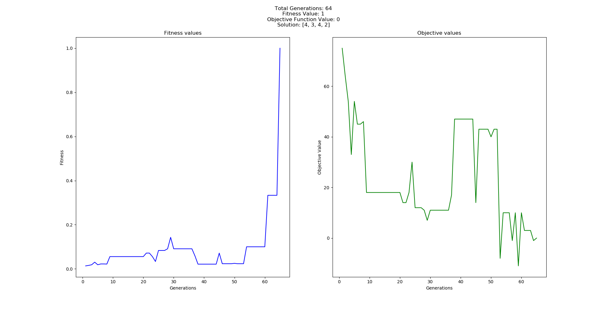

## A Genetic Algorithm Implementation in Python

#### Implementation of genetic algorithm to solve an equation of degree `1`

##### *Objective Function*
```
We need to solve the equation, a + 2b + 3c + 4d = 30
Therefore our objective function is f(x) = a + 2b + 3c + 4d - 30
```

#### Steps for performing Genetic Algorithm

1. **Initialize the population**

Every chromosome is a potential solution to the above problem. So each chromosome should contain 4 variables, representing `a`, `b`, `c` and `d` respectievely.

Let's generate a population of chromosomes. The values of each variable is generated randomly.

```
Chromosome [1] = a b c d ] = [12;05;23;08]
Chromosome [2] = a b c d ] = [02;21;18;03]
Chromosome [3] = a b c d ] = [10;04;13;14]
Chromosome [4] = a b c d ] = [20;01;10;06]
Chromosome [5] = a b c d ] = [01;04;13;19]
Chromosome [6] = a b c d ] = [20;05;17;01]
```

Here we have randomly initialized 6 chromosomes

2. **Evaluation**

Now we evaluate the chromosomes based on the objective function and their fitness values (*`fitness = 1 / obj_fn`*)

```
F_obj [1] = 93
F_obj [2] = 80
F_obj [3] = 83
F_obj [4] = 46
F_obj [5] = 94
F_obj [6] = 55
```

And the fitness values are

```
Fitness [1] = 0.0106
Fitness [2] = 0.0123
Fitness [3] = 0.0119
Fitness [4] = 0.0213
Fitness [5] = 0.0105
Fitness [6] = 0.0179
```

3. **Selection**

Here we perform Tournament based selection strategy. There will a `n` tournaments (`n=total_population`). In each tournament, we randomly select 2 or more candidates. Then we select the candidate with highest fitness value. When the tournament ends, we get a new population of 6 members, that may or may not contain repeated elements.

```
New_Chromosome [1] = a b c d ] = [20;05;17;01]
New_Chromosome [2] = a b c d ] = [02;21;18;03]
New_Chromosome [3] = a b c d ] = [20;01;10;06]
New_Chromosome [4] = a b c d ] = [20;01;10;06]
New_Chromosome [5] = a b c d ] = [01;04;13;19]
New_Chromosome [6] = a b c d ] = [12;05;23;08]
```

Let's say this is our new population

4. **Cross Over**

This is the process of creating offsprings from parents. We already have parents that survived a tournament. Now we need to create children to make them perform better. For crossover, we need to set a parameter crossover-rate `cr`. Let's assume we set `cr` to 0.25. Now we need to generate `6 (population_size)` random numbers, R.

```
R [1] = 0.191
R [2] = 0.259
R [3] = 0.760
R [4] = 0.006
R [5] = 0.159
R [6] = 0.340
```

Select chromosome `k` as parent, if `R[k] < mr`.
We now have `1`, `4`, and `5` as parents. We need to perform `1<<>>4`, `4<<>>5`, `5<<>>1`
For this, in each crossover, we select a random crossover-point, and bring the varibles of second set to first.

```
Chromosome [1] = Chromosome [1] >< Chromosome [4]
    = [20;05;17;01] >< [20;01;10;06] after position 2
    = [02;05;10;06]

Chromosome [4] = Chromosome [4] >< Chromosome [5]
    = [20;01;10;06] >< [01;04;13;19] after position 1
    = [20;04;13;19]

Chromosome [5] = Chromosome [5] >< Chromosome [1]
    = [01;04;13;19] >< [20;05;17;01] after position 2
    = [01;04;17;01]
```

5. **Mutation**

To determine the number of mutations, we need mutation-rate `mr`. 


> Total population = no_of_chromosomes * population_in_each_chromosome
 TP = 4 * 6 = 24
Total number of mutations = int(TP*mr) = int(2.4) = 2 (`n`)
Generate `n` random integers between 1 and TP: 12 and 18
Replace population at 12 th and 18 th places by random numbers between 1 and 30

Now our new population is,
```
New_Chromosome [1] = a b c d ] = [02;05;10;06]
New_Chromosome [2] = a b c d ] = [02;21;18;03]
New_Chromosome [3] = a b c d ] = [20;01;10;**02**]
New_Chromosome [4] = a b c d ] = [20;04;13;19]
New_Chromosome [5] = a b c d ] = [01;**05**;17;01]
New_Chromosome [6] = a b c d ] = [12;05;23;08]
```

Repeat the process until convergence pr desired number of iterations

### Results


Here we can see the plot of fitness values and objective values. Above it's written the solution as [4, 3, 4, 2]

`4 + 3*2 + 4*3 + 2*4 - 30 = 0`. Hence we have arrived at the solution.

The parameters used here are
```
POPULATION_SIZE = 6
CROSSOVER_RATE = 0.7
MUTATION_RATE = 0.1
ITERATIONS = 1200
```
Even though we set `ITERATIONS=1200`, we received a solution at `generation 64`. If we change the parameters, we could reach the solution at a different generation. 